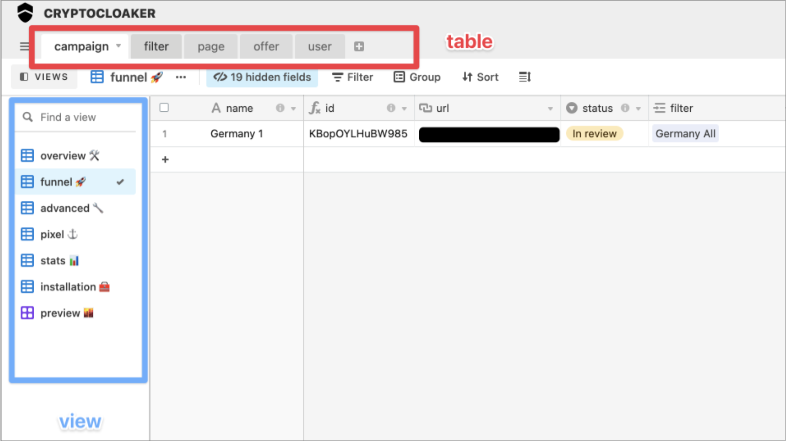
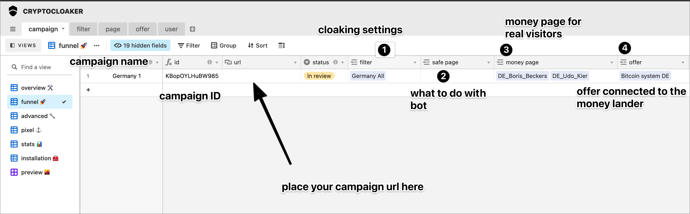
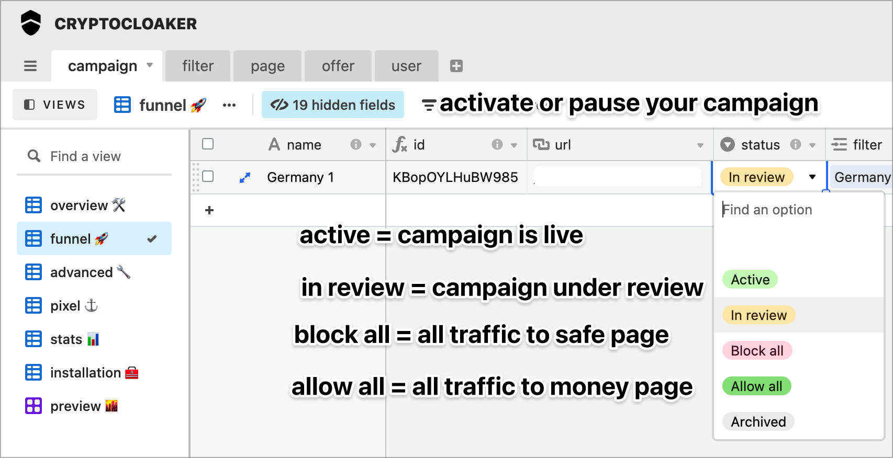
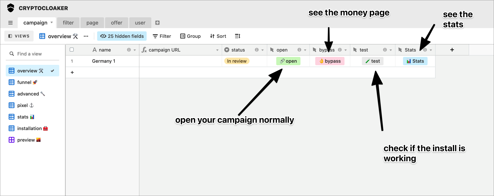
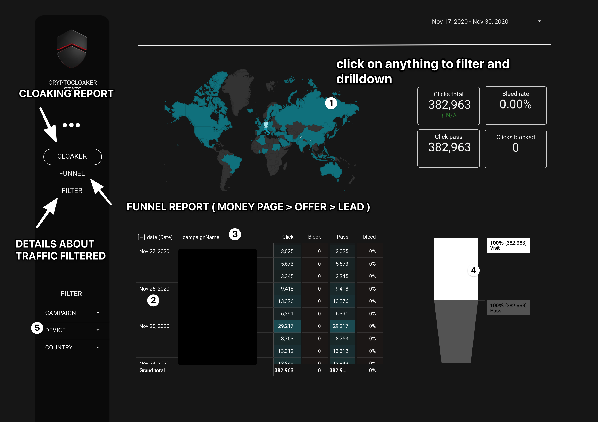

# 🚀 Quick start

## How to install 🛠

There are two ways to install the cloaker. It depends of what kind of safe pages you are using

* If you it's a custom domain or website, it's DNS cloaking. We install the cloaker at the domain level, on your cloudlflare account.
* If you are using a third-party service like shopify, wix, squarespace... it's JS cloaking. You place  our JS code on your safe site.

## How the dashboard works 👩‍💻

* At the top, you have the **table** or tabs
* on the left side, you have **views**. Views are just a way to hide and order the fields. You can change it the way you want.

* **CAMPAIGN** = your campaigns
* **FILTER** = cloaking settings
* **PAGE** = list of money and safe page
* **OFFER** = offer

## How to start a campaign 🚀

To make a campaign, you need : 

* a [filter](cloaker/filter-1/) \( the cloaker settings = what traffic to allow \) 
* a [money page](cloaker/page/money.md)
* a [safe page](cloaker/page/safe.md) 
* offer

## How to activate your campaign ✅

## How to test your campaign 🧪

## How to check your stats

Click on the blue button **stats** to open the report.

