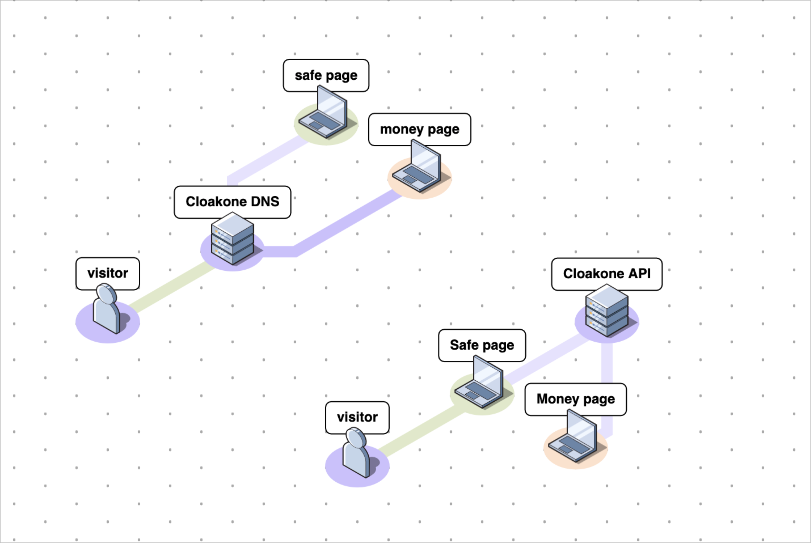
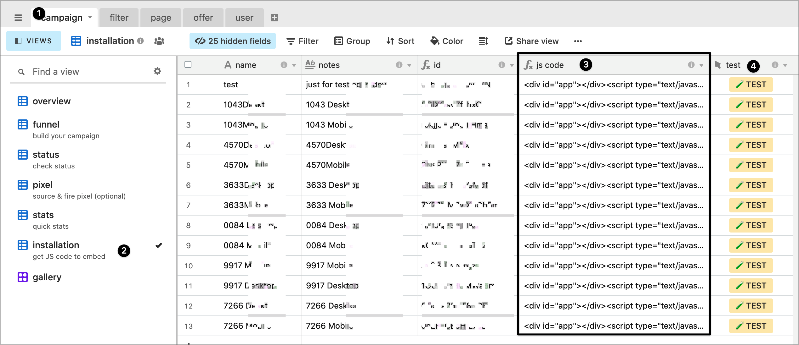
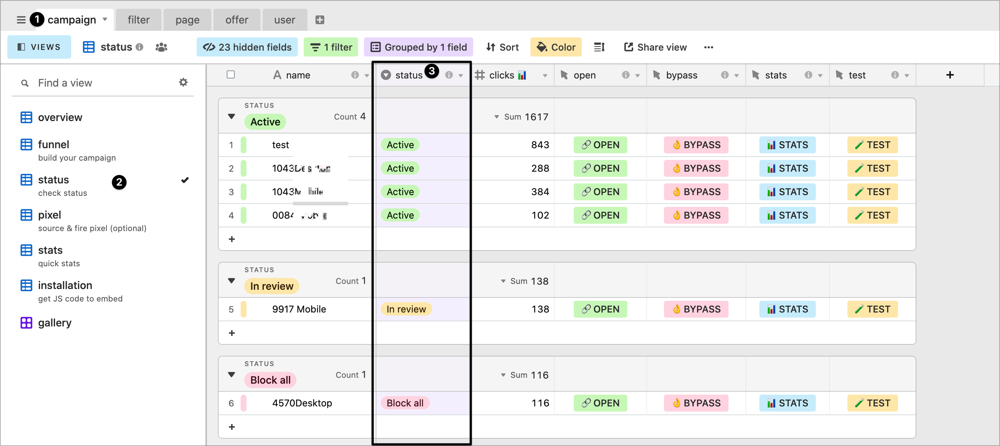
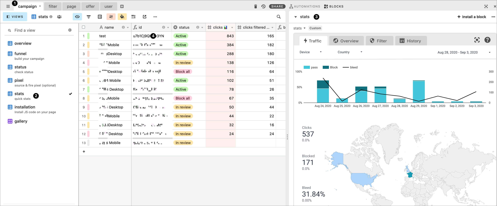

# 🚀 Quick start

First read this [intro](https://www.notion.so/How-this-new-technology-probably-make-Cloakone-com-the-best-cloaker-efb5711be5684cf085eeffcd55be9a26) about why Cloakone will take your campaign to the next level

Cloakone works like a puzzle. Start with the [installation](./#installation), then [build your campaign](./#build-funnel) by combining these pieces :


1. [filter](./#filter)
2. [money page\(s\), ](./#page)
3. [safe page ](./#safe-page)
4. offer \( Pro version \) 


## Installation 🛠

Cloakone offer two ways to [install](cloaker/installation/)

* [DNS](cloaker/installation/#dns). If you own the domain name, install Cloakone on your DNS. \(cloudflare\). Cloakone is the first cloaker that operate at the DNS level. 
* [JS](cloaker/installation/#js). If you are using a third-party website \( shopify, wix, squarespace etc... \) without domain ownership, include our JS code on your page. 

## Filter  🛡️

Our design choice is to let you select the broad settings \( [location](cloaker/filter-1/location.md) 🌍, [connection](cloaker/filter-1/connection.md) 🌐, [device](cloaker/filter-1/device.md) 🖥, [day-parting](cloaker/filter-1/scheduler.md) ⏱\) and we take care of the small tweaks with a [traffic score](cloaker/filter-1/score.md). With the score 💯, you modulate the filter strength, and we adjust all the small settings accordingly. 🦾

**To give you the big picture,**

* It's always a trade-off between protection and click loss \( = bleed rate 🔥 \).
* Cloakone use both server side detection 🌐\( ip, ua, headers \) and client side detection 👩‍💻\( a lot of data \)  
* score &gt;=50 has both server-side and client-side checks activated.
* choose score &lt;50 if you want server-side check only.




**Our recommendation 🧙‍♂️**

While your campaign is warming up, select a high score &gt;70 and be extra safe. Then, as your campaign get stronger you can lower the score to optimize delivery.


## Page 👨‍💻

To start your first campaign:

* place one [safe page](cloaker/page/safe.md) and one [money page](cloaker/page/money.md)
* you can either host your lander on Cloakone by simply [dropping a file ](cloaker/page/new.md#drop-a-file) 📁or [place your url](cloaker/page/new.md#place-an-url) 🔗\( tracker or lander url \)
* you need to choose a [page method](cloaker/page/method.md) 🔀to load your page, either [iframe](cloaker/page/method.md#iframe) 🌃, [redirect](cloaker/page/method.md#redirect) 🔗 or [reverse proxy](cloaker/page/method.md#reverse-proxy) ☁️

## Campaign 🚀

### Build funnel 🧩

To build a campaign, go into view funnel, and plug :

* [filter](cloaker/filter-1/)
* [money page](cloaker/page/money.md)
* [safe page](cloaker/page/safe.md)
* offer \( Pro version \) 
* options : [tracking](cloaker/campaign/tracker.md), backbutton, heatmap \( Pro version \) 

Finally, we can put each piece together \( domain, page and filter \) to make our campaign.

### Install 👌

You need to[ install cloakone globally on your DNS](cloaker/installation/dns/) \(cloudflare account\) first, then connect your domain. If you are using the [JS method](cloaker/installation/js/), place this code on your page \(3\). Click on [button test](cloaker/campaign/debug.md), to see if the installation is successful \(4\)

### Status ✅

**Campaign status :**

* **Active** – The campaign is active.
* **Allow all** – All visitors are allowed. Will see money page.
* **Block all** – No visitors allowed. Will see safe page.
* **In review**  – Select this mode when your campaign is under review. All traffic will be blocked, but cloakone will learn specifically from that traffic to better protect your campaign. 
* **Archived** – Campaign is deactivated. Traffic is not processed \( click won't counted in your balance \). No fingerprint :  If using DNS method, visitors will see a blank page. If using JS method, visitor will stay on your page.


When your campaign is under review, select either **block all**, or **under review**. Both status are blocking traffic, but **under review** mode show the JS code and learn specifically about your campaign. Once it's approved, set status as **active** with a **high traffic score** \( &gt;=70 \) at the beginning. Then lower the score to optimize delivery.


### Pixel ⚓️ \( Pro version \)

Cloakone has[ built-in integration](cloaker/campaign/pixel/) for firing pixel to your traffic source safely. It also has [built-in tracking](cloaker/campaign/tracker.md), can inject [backbutton](cloaker/campaign/options.md#backbutton) script, [heatmap](cloaker/campaign/options.md#heatmap) and [analytics](cloaker/campaign/options.md#tracking). [Read more here](cloaker/campaign/)

## 📊 stats

You can see your campaign settings and stats side-by-side. Go into campaign \(1\), view stats \(2\), open the stats block \( or click on the stats button to open it \) \(3\). To filter and show stats for a specific campaign, select a campaign id \(4\)

The block stats is a simple report with the most important metrics \( clicks, history, results, reason \) in real time.

