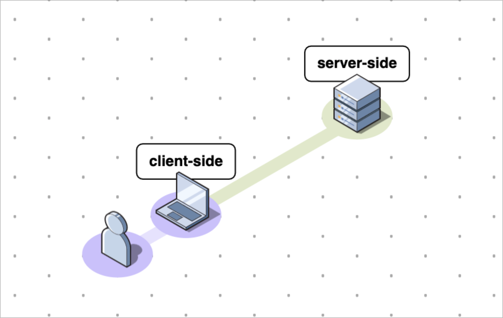

# 😇 a cloaking story

Alright, it's a little long, but after you read this post, you will know everything you need to know about cloaking and using cloakone. 

### How does it works? the basics.

**There are two ways to get a visitor information.**

* Server-side -  the visitor IP and UA \( user-agent \) 
* Client-side - by extracting information with javascript from the visitor browser. 

The server side integration is the easiest and you these features are available in most tracker and cloaker. \(  geo or devices redirect rules \)  

The issue is that if a visitor use a fresh residential proxy and fake his user agent, he will likely pass server-side checks. \( like multilogin \) 

So you absolutely need client-side check. You can't expect to have any decent protection without.

### **What's the current scene looks like?**

Because client-side checks are a bit more complex, we found that other tools failed to properly implement it. They check basic things \( timezone match between device/ip \), but advanced bot have already catch-on. Moreover they have high bleed rate, so you will loses many clicks.

The reason is that other cloakers are trying to support many integration , and are using outdated methodology \( php, nginx, ajax \) and in our opinion fail to focus on what really matters.  


### a little glossary

* **Valid visitors** – visitors that pass all of your tests and are cleared by your filters.
* **Filtered visitors** – visitors who fail one or more of your tests/filters.
* **Safe Page** –  bot page. filtered visitors will see this page.
* **Money Page** –  real page. this is the page that your valid visitors will be directed to.
* **campaign** –  campaign. 
* **filter** –  cloaking. 


