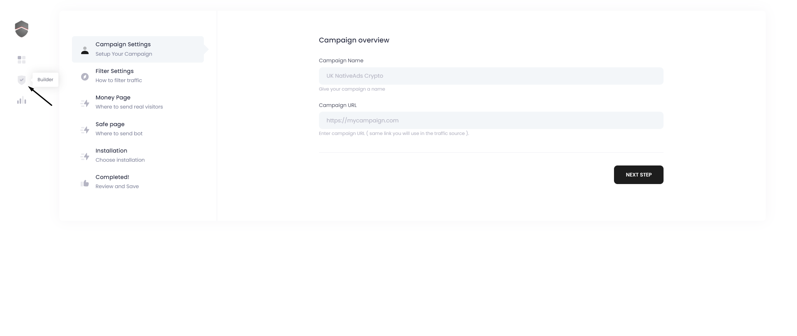
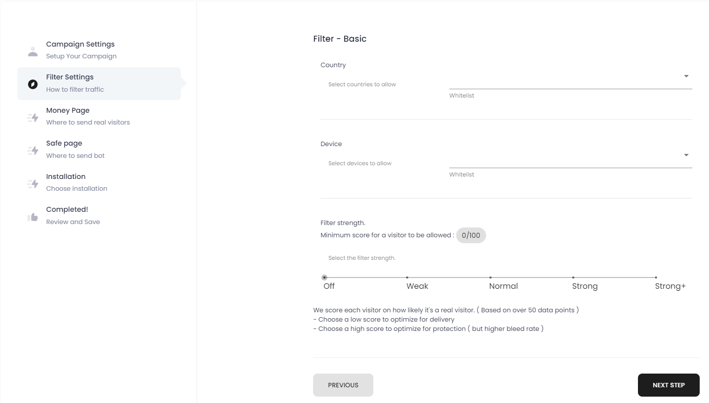
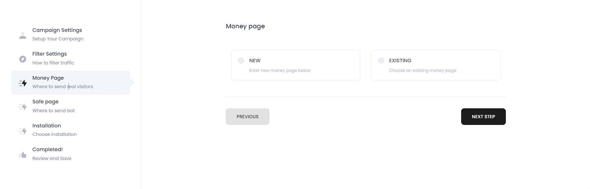
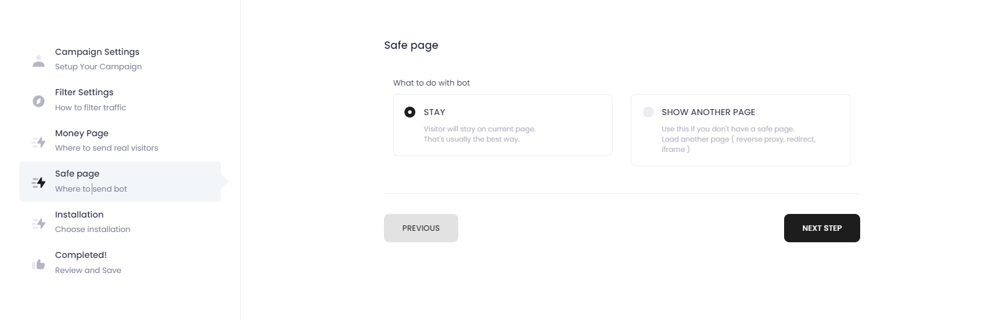
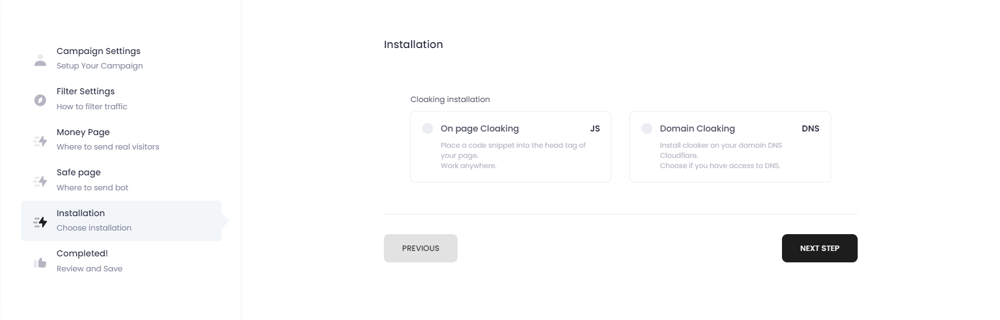
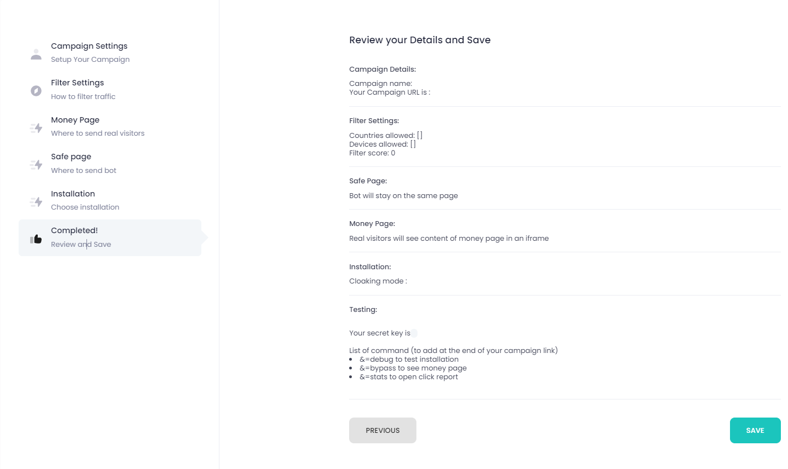

# 🚀 Campaign

## Campaign

To build a campaign, go to builder page:

Set the campaing name and your domain

**Select your filters**

**Select money page**

**Set Safe page settings**

**Choose installation type**

**Review your campaing**

