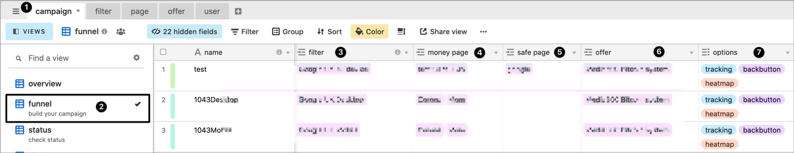

# 🚀 Campaign

##  Campaign

To build a campaign, go into view funnel, and plug :

* [filter](../filter-1/)
* [money page](../page/money.md)
* [safe page](../page/safe.md)
* offer \( Pro version \) 
* options : [tracking](tracker.md), backbutton, heatmap \( Pro version \) 

### 

