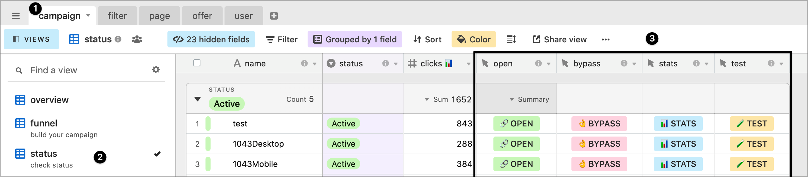
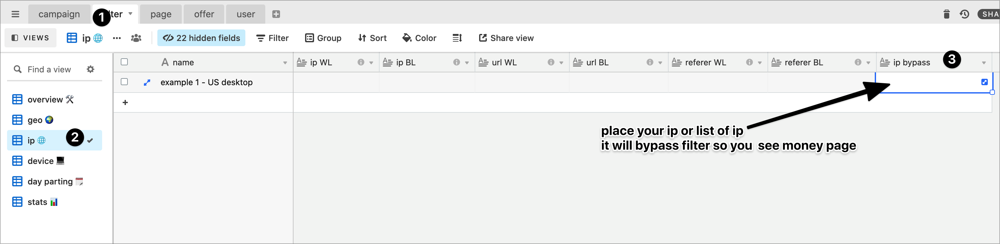

# 🧪 debug

## Debug your campaign 🧪

**Buttons**

* **open** — will open your link normally
* **bypass** — will open your link and bypass any filter, you will see money page
* **stats** — will open your stats in standalone mode. It's useful to give stats access on campaign level to your VA or partner without sharing your login and whole access to your dashboard.
* **test** — will load your link and show you the cloaker response and reason your are being filtered. \( You can see if you place the code successfully \) 


### You can also switch mode manually, by adding a token in your link:

* **&yoursecretkey=debug** — to see the cloaker response \( = button test \)
* **&secretsecretkey=bypass** — to see the money page  \( = button bypass \)
* **&yoursecretkey=stats** — to see stats\( = button stats \)


## Debug your campaign in JS mode 📎🧪

Depending on what site or setup you are placing the JS code, the referer might not be pass, so the bypass button \( which is adding &secretkey=bypass in the URL \) will not work

Instead you need whitelist your IP \( like the other cloaker are doing \)

you do this in filter &gt; IP &gt; ip bypass

## secret key 🔑

You secret key is used to test your link.

