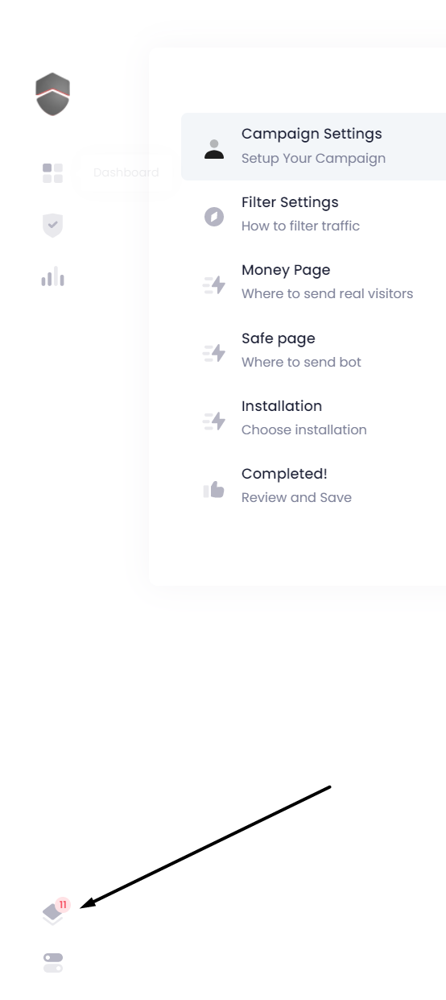

# 🔔 notification

## you can check notifications for your account:

it will trigger on whatever you wish to track

Examples:

* clicks coming on your campaign
* change in status
* any issue \( if it happens \) 
* you can also select which campaign to watch \( if not all \) 

