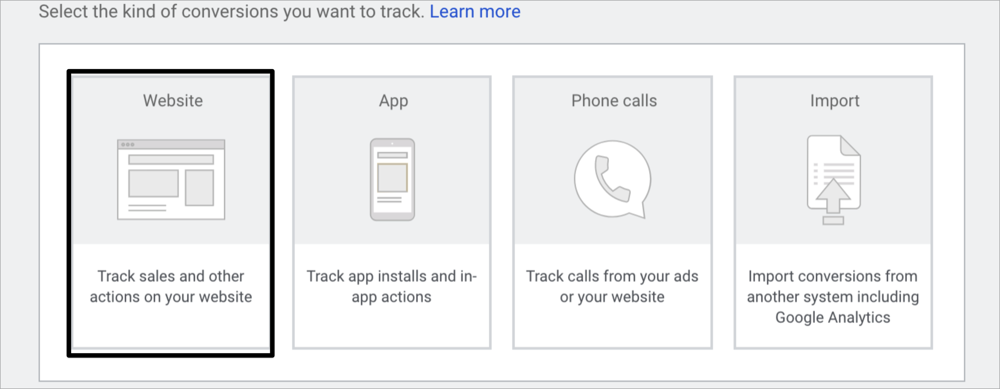
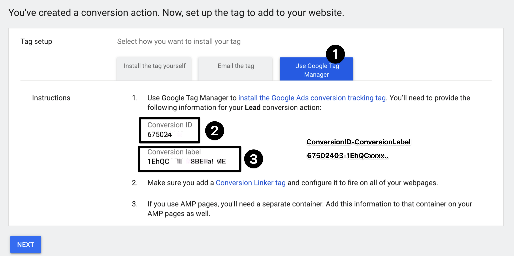

# google

## setting up the pixel ⚓️

* Create a conversion event
* Make sure google glcid auto-tagging is on

## Create a conversion 

1. Choose Website
2. keep note of the _**conversion ID**_ \( associated to your googleads account \) and _**conversion Label**_ \( specific to that conversion event \)
3. Set up pixel on your campaign as `{conversion ID}-{Conversion Label}`

   in this example, it looks like this:`675024-1eHQXXX...`

## auto tagging gclid

You need to activate google auto tagging gclid

