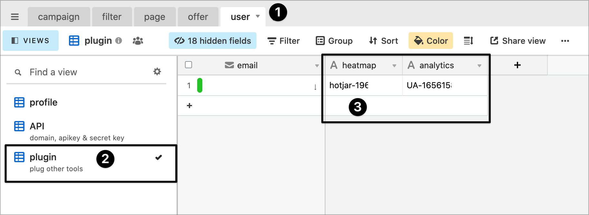

# 🧰 Plugin

## What is it? 🤔

Cloakone let you easily add other tools on your funnels. Currently support : 

* heatmap/recording — hotjar 🔥
* analytics — Google analytics 📊

Go in table user, &gt; view plugin, and place your IDs there.

## Integration 🧰

### hotjar 🔥

* when opening an account, put any url. 
* Only the recording will works, heatmap will not. 
* Place your ID in heatmap field, as `hotjar-XXX`\( replace XXX by your hotjar id \) 

### Google analytics 📊

* place your Google analytics ID, like `UA-XXXXX`

