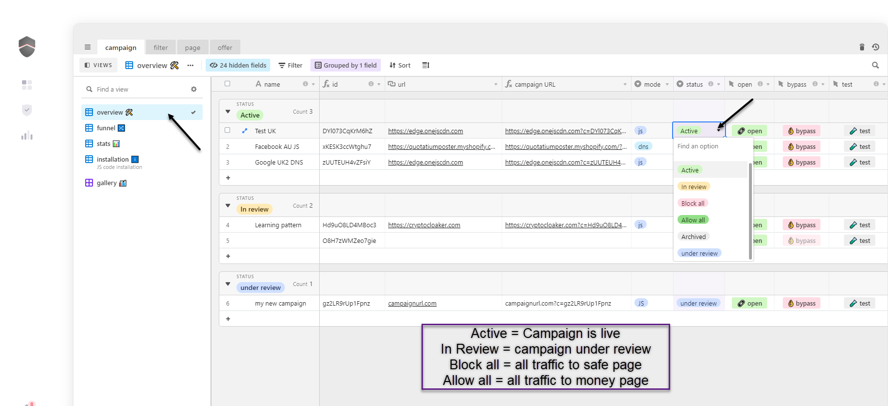

# ✅ Status

**Campaign status :**‌

* **Active** – The campaign is active.
* **Allow all** – All visitors are allowed. Will see money page.
* **Block all** – No visitors allowed. Will see safe page.
* **In review** – Select this mode when your campaign is under review. All traffic will be blocked, but cloakone will learn specifically from that traffic to better protect your campaign.
* **Archived** – Campaign is deactivated. Traffic is not processed \( click won't counted in your balance \). No fingerprint : If using DNS method, visitors will see a blank page. If using JS method, visitor will stay on your page.

