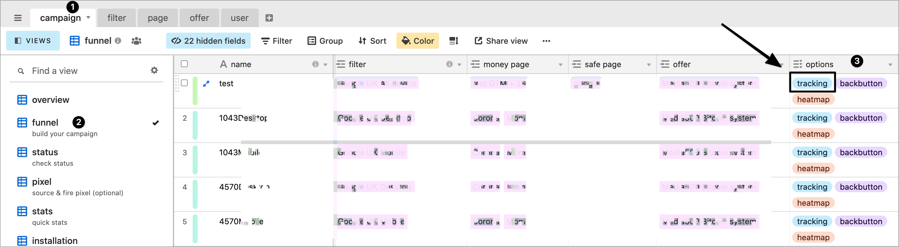

# 🔄 Tracking

## What is this? 🙆‍♀️

Unless you are building complex funnels, you don't need an external tracker to manage your lander and offers. Cloakone has built-in rotation 🔄 and tracking 📈, that fits most use cases.

To activate tracking, add the tracking tag in field **options**

**Features**:

* [match offer name in your lander dynamically 🔄](tracker.md#match-lander-with-offer-dynamically)
* [rotate landers and offers 🔄](tracker.md#rotate-lander-and-offer-in-your-campaign)
* [pass parameter to your offer 📈](tracker.md#passing-parameter-in-your-offer-link)
* track campaign parameters 📈
* track lander behavior time and CTR  📈

## Match lander with offer dynamically 🔄

Cloakone will replace your offer name and URL in your lander dynamically.

Place these token in your lander, so we replace accordingly

| name | token |
| :--- | :--- |
| offer url | \#OFFERLINK\# or \#OFFERURL\# |
| offer name | \#OFFERNAME\# or \#OFFER\# |
| offer image url | \#OFFERIMAGE\# |
| offer image step1 url | \#STEP1\# or \#OFFERSTEP1\# |
| offer image step2 url | \#STEP2\# or \#OFFERSTEP2\# |
| offer image step3 url | \#STEP3\# or \#OFFERSTEP3\# |

## Rotate lander and offer in your campaign 🔄

you can select one or more page and offer.

## Passing parameter to the offer  📈

You can use following token to pass metadata to your affiliate network or offer

|  | token |
| :--- | :--- |
| campaign ID | {campaign} |
| campaign name | {campaign.name} |
| clickid | {clickid} |
| device type \( desktop / mobile \) | {device} |
| user agent | {ua} |
| traffic score | {score} |
| time \( click time to offer \) | {time} |
| url query | {query} |

## Passing parameter to your lander 📈

You can use following tokens to pass parameter to your lander \( like if you are using your own tracker \)

<table>
  <thead>
    <tr>
      <th style="text-align:left"></th>
      <th style="text-align:left">token</th>
    </tr>
  </thead>
  <tbody>
    <tr>
      <td style="text-align:left">full query</td>
      <td style="text-align:left">{query}</td>
    </tr>
    <tr>
      <td style="text-align:left">
        
MATCH ALL :
           pass any param from your campaign url, ie:

        
yourcampaign.com?keyword=XXX, use token {keyword}

      </td>
      <td style="text-align:left">{XXX}</td>
    </tr>
    <tr>
      <td style="text-align:left">campaign ID</td>
      <td style="text-align:left">{campaign}</td>
    </tr>
    <tr>
      <td style="text-align:left">campaign name</td>
      <td style="text-align:left">{campaign.name}</td>
    </tr>
    <tr>
      <td style="text-align:left">clickid</td>
      <td style="text-align:left">{clickid}</td>
    </tr>
    <tr>
      <td style="text-align:left">device type ( desktop / mobile )</td>
      <td style="text-align:left">{device}</td>
    </tr>
    <tr>
      <td style="text-align:left">user agent</td>
      <td style="text-align:left">{ua}</td>
    </tr>
    <tr>
      <td style="text-align:left">traffic score</td>
      <td style="text-align:left">{score}</td>
    </tr>
    <tr>
      <td style="text-align:left">time ( click time to offer )</td>
      <td style="text-align:left">{time}</td>
    </tr>
  </tbody>
</table>

