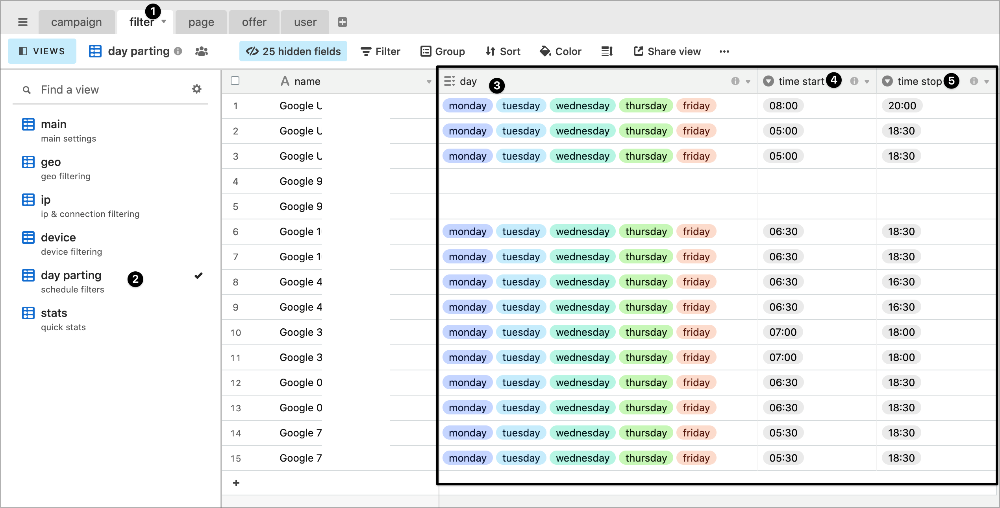

# ⏱ Day-parting

If you are running your campaign only during specific hours, then use the scheduler to allow traffic only during specified hours


timezone is UTC, adjust the time accordingly. 

**Example:**

* you launch a campaign in USA from 8h to 20h local time GTM-4 , you need to set schedule from 12:00 to 24:00
* you launch a campaign in Germany from 8h to 20h local time GTM+1 , then set schedule from 7:00 to 19:00



Day parting is optional. If you let the fields empty, then the campaign will accept traffic at all time.


.

