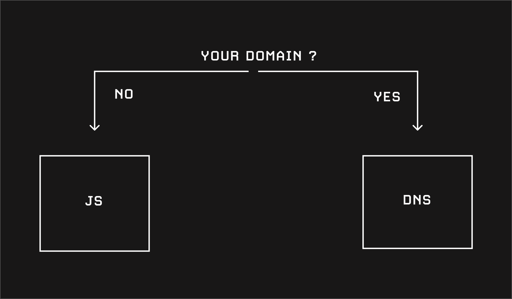

# 🛠 installation

## Methods

There are two ways to use cloakone

* [DNS](./#dns). If you own the domain name, install Cloakone on your DNS. \(cloudflare\). Cloakone is the first cloaker that operate at the DNS level. 
* [JS](./#js). If you are using a third-party platform for your website, and you don't own the domain, insert our JS tag in your page. 

<table>
  <thead>
    <tr>
      <th style="text-align:left">INSTALL COMPARISON</th>
      <th style="text-align:left">DNS &#x1F310;</th>
      <th style="text-align:left">JS <a href="https://emojipedia.org/scroll/">&#x1F4DC;</a>
      </th>
    </tr>
  </thead>
  <tbody>
    <tr>
      <td style="text-align:left"><b>Speed</b>
      </td>
      <td style="text-align:left">extremely fast ( DNS level &lt; 60ms )</td>
      <td style="text-align:left">very fast ( visitor hit your website first )</td>
    </tr>
    <tr>
      <td style="text-align:left"><b>Strength</b>
      </td>
      <td style="text-align:left">extremely secure</td>
      <td style="text-align:left">extremely secure</td>
    </tr>
    <tr>
      <td style="text-align:left"><b>Choose if</b>
      </td>
      <td style="text-align:left">
        <ul>
          <li>you own the domain name ( ie bought on namecheap )</li>
          <li>you bought an account with a domain attached to it ( like wordpress, or
            a custom html website )</li>
        </ul>
      </td>
      <td style="text-align:left">
        <ul>
          <li>using third-party service to host your page. ( shopify, wix, squarespace,
            github, weebly ...).</li>
          <li>You don&apos;t own the domain</li>
        </ul>
      </td>
    </tr>
    <tr>
      <td style="text-align:left"><b>How to use</b>
      </td>
      <td style="text-align:left">Connect your domain to cloudflare. See DNS installation</td>
      <td style="text-align:left">Add our JS code in your page. Place it just after the &lt;body&gt; tag</td>
    </tr>
    <tr>
      <td style="text-align:left"><b>Safe page method</b>
      </td>
      <td style="text-align:left">Reverse proxy any website</td>
      <td style="text-align:left">use your website safe page</td>
    </tr>
    <tr>
      <td style="text-align:left"><b>Money page method</b>
      </td>
      <td style="text-align:left">any</td>
      <td style="text-align:left">any</td>
    </tr>
  </tbody>
</table>

