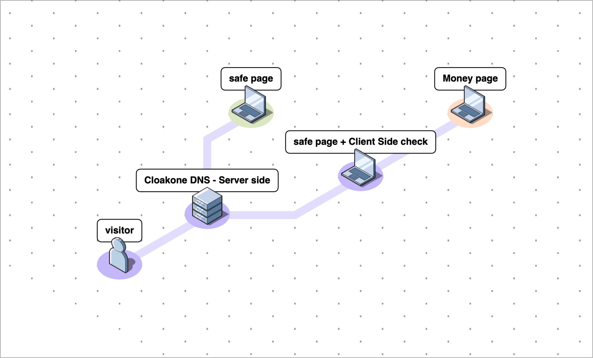

# 🌐 DNS

## **DNS cloaking is a revolutionary way to cloak.** 

### **What are the benefits ?** 

* it's faster as the filtering happen at the DNS level, before even reaching your page and server.
* it allow you to completely separate the domain you use for your campaign and where the page is hosted. So you only need to upload your safe page or money page once, and use it on any domain you want. 

### What are the downside

* you need to own the domain to have DNS access
* domain DNS should be cloudflare

### How to use it  📖

* I — [Install cloakone on your cloudflare account.](worker.md) \(1min\) 
* II — [Attach your domain](domain.md) \(1min\)

### How it works

## 

