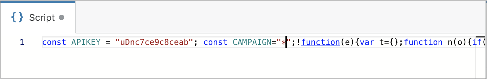

# 👻 Shadow mode

**Shadow mode or generic mode**

By default you pass your campaign ID in your campaign Link. If you want to hide that campaign ID from your campaign Link, you can use shadow mode

## Default mode 🔗

This is the default mode. Notice the `CONST CAMPAIGN="*"`

In generic mode you are passing the campaign ID in your campaign URL. You can use one of these parameters to pass it.

* utm\_campaign=XXX 
* campaign=XXX
* c=XXX

We believe that passing the campaign ID with **utm\_campaign** is safe, as most of the website are using these UTM with google analytics.

## Shadow mode 👻

By default the cloaker recognize the campaign from the URL. You have nothing to do.


It only works if you use a unique URL per campaign. \( subdomain or path \).

example

#### with subdomain

* sub1.domain.com   ==&gt; Campaign 1
* sub2.domain.com   ==&gt; Campaign 2
* ...

#### with path

* domain.com/path1   ==&gt; Campaign 1
* domain.com/path2   ==&gt; Campaign 2
* ...


### 

