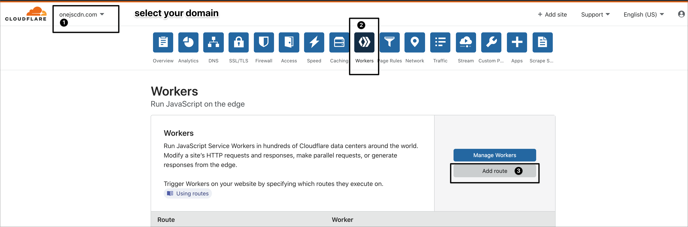
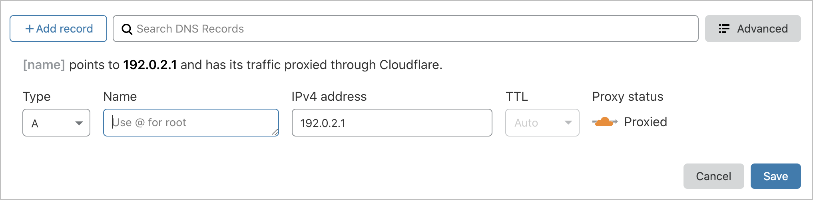
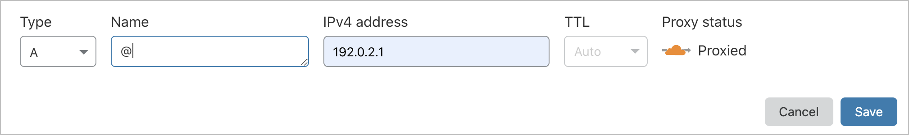
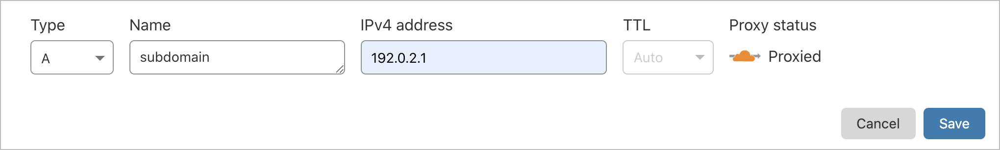

# 🌐 Connect your domain

Once you installed your Cloakone code in a worker, attach the domain that you want to use for your campaign. First you [add a route](./#create-a-route-to-the-worker), then you [add a DNS record](./#add-a-record)

## **Create a route to the worker**

**Select your domain**, go to the **workers** section, then click **Add route**

* Optionally, you can use a subdomain or add a custom path. 
* Then **make sure to add the  wildcard /\* at the end.** 
* your path should look any of these:

| Route | Match |
| :--- | :--- |
| domain.com/\* | cloak root domain |
| sub.domain.com/\* | cloak only subdomain |
| \*.domain.com/\* | to cloak all subdomains |
| domain.com/path\* | cloak a specific path |

* Choose the worker "cloakone", that we created previously, then click save.

## Add DNS record

add a A record to your domain to the route, pointing to **192.0.2.1**

### Examples


* with a custom path — domain.com**/safepage/\***
  * route: `domain.com/*`
  * dns record:  `@ pointing to your safe page or 192.0.2.1`



* with a subdomain
  * route: `sub.domain.com/*`
  * dns record: `sub pointing to your safe page or`

    `192.0.2.1`


