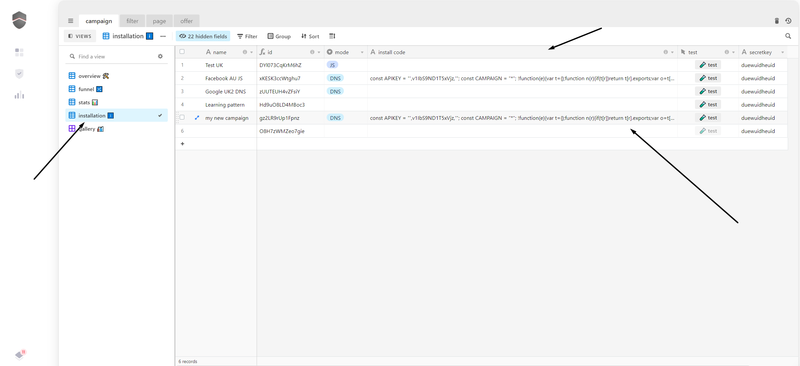
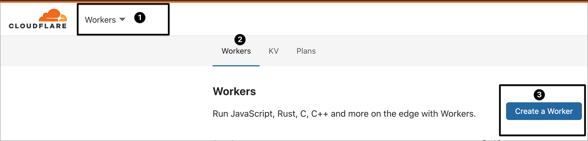
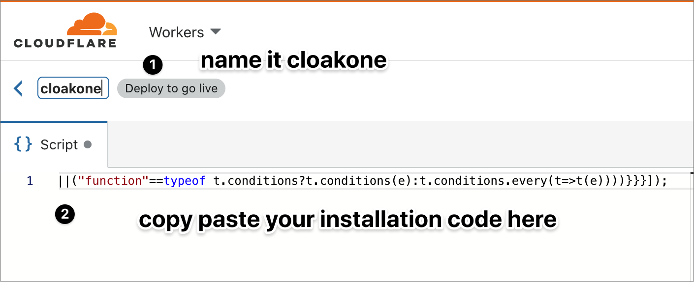

# 🦾 Install the Worker

**Step 1.** Copy your installation code from your dashboard. You find it installation view

* **Step 2.** go on your **cloudflare account**, go to **worker \(1\),** and click **create a worker \(3\)**

* **Step 3**. copy past your installation code \(2\). Click **Save and deploy.**


You can connect as many domains as you want to your worker. You only need to do the installation once.


