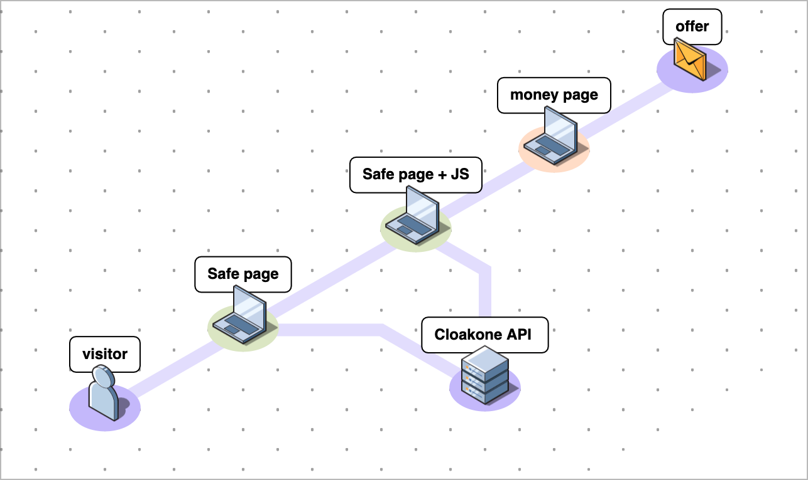

# 📋 JS

## **JS cloaking**

### **What are the benefits ?**

* use on any website. You just need to be able to place a JS tag.
* Our JS cloaking is unique because it's hybrid. \( no fingerprint \)  

### What are the downside

* There is a request to your domain \( unlike DNS where it's invisible \) 

### How to use it  📖

* [copy paste your installation code in your page](installation.md) 📋
* [optionally, proxy the JS with your own domain]() 🌐

### How it works 🕵️‍♀️


Unlike other cloaker, our JS integration is hybrid and don't show any fingerprint.  
The fingerprinting code is only injected if visitor pass server side check.

Cloakone is the first and only cloaker able to do this. \( without a php backend \)


