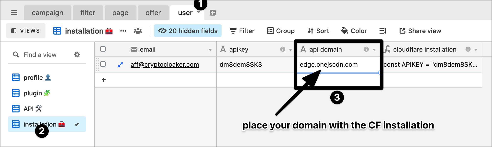

# 🌐 Custom domain

We attribute a default domain to host our API.


To change the default domain, proceed with a [DNS](../dns/) installation on one of your domain

You can have an unlimited amount of domain to host our API, see DNS installation


