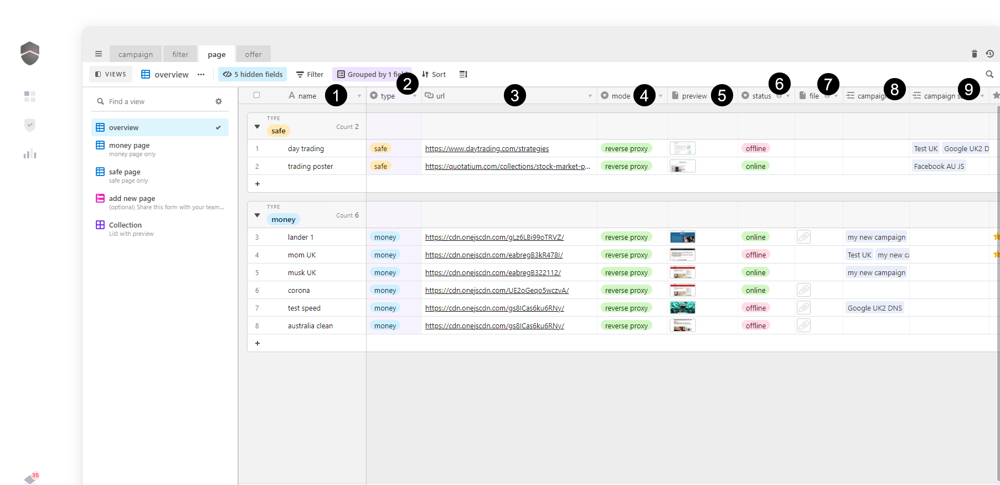

# 🌅 page

## What is it?

1. name － give a name to your page
2. type － safe page \(  bot \) 😇or money page \( real users \) 💵
3. url － if you are using a tracker or already have your page hosted,  [place your url](new.md#place-an-url) 
4. mode －  [page method](method.md), how to load your page \( iframe/redirect/reverse proxy\) 🔀
5. preview － will automatically take a screenshot of your page once it's loaded
6. status － will automatically check your page uptime and switch in case of issue
7. file － [drop a file ](new.md#drop-a-file)\( built-in one-click hosting \) 📁 . your url will get generated in about a minute.
8. campaign money － see which campaign is using that money page
9. campaign safe － see which campaign is using that safe page

