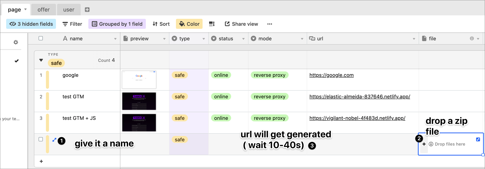
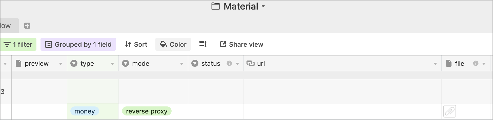

# ⬆️ add new page

two ways to add your pages:

* drop a file 📁
* place a url 🔗

## drop a file 📁

you don't need any hosting or server. Cloakone have built-in one-click page hosting.

* give a name to your page
* drop a zip file 
* wait for the url to get generated \( take up to 1min \) 

## place an url 🔗

if you already have hosted your lander, or want to use your own tracker, then place your url


if you are using your tracker with the reverse proxy method, note that the IP you will see if our server IP, not the original visitor. If you have some geo redirecting rules, then use iframe / redirect


