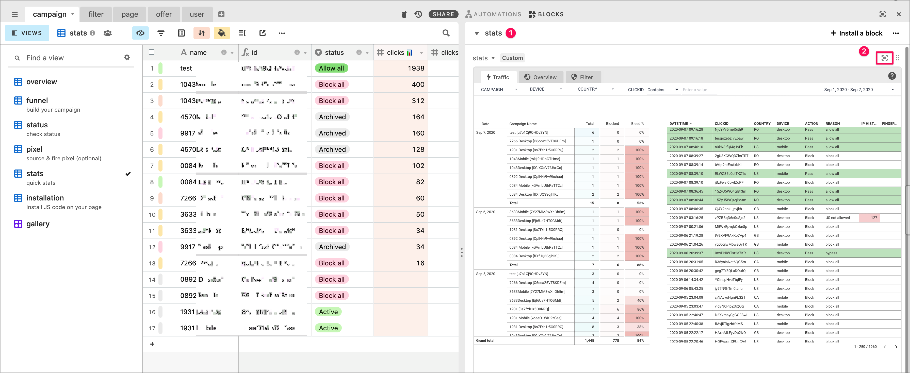

# 📊 stats

* full report 📈— stats from all your campaigns
* campaign stats 📊 — click on a campaign ID to show stats from that campaign campaign

## Full report

Opening the stats block by default will show you overall stats. You can click on any record to filter the view

## Campaign stats

Go into campaign \(1\), view stats \(2\), open the stats block \( or click on the stats button to open it \) \(3\). To filter and show stats for a specific campaign, select a campaign id \(4\)   
This report is smaller and less detailed as it is meant to be viewed side by side with you campaign settings.

The block stats is a simple report with the most important metrics \( clicks, history, results, reason \) in real-time.

You can then navigate to the other tab:

* **traffic** — show each click
* **overview** — overview of trend and geo
* **filter** — breakdown of filters

